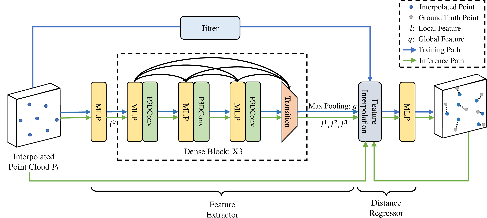

# Grad-PU

 [arXiv](https://arxiv.org/abs/2304.11846) | [Project Page](https://yunhe20.github.io/Grad-PU) | [Code](https://github.com/yunhe20/Grad-PU)

This is the official PyTorch implementation of our paper "Grad-PU: Arbitrary-Scale Point Cloud Upsampling via Gradient Descent with Learned Distance Functions" (CVPR 2023).



## Abstract

Most existing point cloud upsampling methods have roughly three steps: feature extraction, feature expansion and 3D coordinate prediction. However, they usually suffer from two critical issues: (1) fixed upsampling rate after one-time training, since the feature expansion unit is customized for each upsampling rate; (2) outliers or shrinkage artifact caused by the difficulty of precisely predicting 3D coordinates or residuals of upsampled points. To adress them, we propose a new framework for accurate point cloud upsampling that supports arbitrary upsampling rates. Our method first interpolates the low-res point cloud according to a given upsampling rate. And then refine the positions of the interpolated points with an iterative optimization process, guided by a trained model estimating the difference between the current point cloud and the high-res target. Extensive quantitative and qualitative results on benchmarks and downstream tasks demonstrate that our method achieves the state-of-the-art accuracy and efficiency.

## Installation

* Install the following packages

```
python==3.7.11
torch==1.7.1
CUDA==11.0
numpy==1.21.2
open3d==0.9.0.0
einops==0.3.2
scikit-learn==1.0.1
tqdm==4.62.3
h5py==3.6.0
```

* Install the built-in libraries

```
cd models/Chamfer3D
python setup.py install
cd ../pointops
python setup.py install
```

* Compile the evaluation_code for metric calculation (optional)

To calculate the CD, HD and P2F metrics, you need to install the CGAL library (please follow the [PU-GAN](https://github.com/liruihui/PU-GAN) repo) and virtual environment of PU-GCN (please follow the [PU-GCN](https://github.com/guochengqian/PU-GCN) repo) first. And then you also need to compile the `evaluation_code` folder.
```
cd evaluation_code
bash compile.sh
```

These commands are tested on an ubuntu 16.04 system.

## Data Preparation

First download the PU-GAN ([train set](https://drive.google.com/open?id=13ZFDffOod_neuF3sOM0YiqNbIJEeSKdZ), [test mesh](https://drive.google.com/open?id=1BNqjidBVWP0_MUdMTeGy1wZiR6fqyGmC)) and [PU1K](https://drive.google.com/drive/folders/1k1AR_oklkupP8Ssw6gOrIve0CmXJaSH3?usp=sharing) datasets, then unzip them and put them into the `data/PU-GAN/train` folder, `data/PU-GAN` folder and `data/PU1K` folder repestively. Since the PU-GAN dataset only provides mesh files for test, we first generate test point clouds by Poisson disk sampling.

* PU-GAN test point cloud generation

```
# 4X, generated files will be saved at ./data/PU-GAN/test_pointcloud/input_2048_4X by default
python prepare_pugan.py --input_pts_num 2048 --gt_pts_num 8192
# 16X, generated files will be saved at ./data/PU-GAN/test_pointcloud/input_2048_16X by default
python prepare_pugan.py --input_pts_num 2048 --gt_pts_num 32768
# 5X, generated files will be saved at ./data/PU-GAN/test_pointcloud/input_2048_5X by default
python prepare_pugan.py --input_pts_num 2048 --gt_pts_num 10240
```
where `input_pts_num` denotes the point number of input low-res point cloud, `gt_pts_num` denotes the point number of ground truth high-res point cloud, and you can modify these two arguments to obtain various upsampling rates or input sizes. 

You can also use the `noise_level` argument to generate the noisy low-res input.
```
# 4X, noise_level=0.01, generated files will be saved at ./data/PU-GAN/test_pointcloud/input_2048_4X_noise_0.01 by default
python prepare_pugan.py --input_pts_num 2048 --gt_pts_num 8192 --noise_level 0.01
```

The final file structure of `data` folder is shown as follow:

```
data  
├───PU-GAN
│   ├───test # test mesh file
│   ├───test_pointcloud # generated test point cloud file
│   │     ├───input_2048_16X
│   │     ├───input_2048_4X
│   │     ├───input_2048_4X_noise_0.01
│   │     ...
│   └───train
│   │     └───PUGAN_poisson_256_poisson_1024.h5
└───PU1K
│   ├───test
│   │     ├───input_1024
│   │     ├───input_2048
│   │     ...
│   └───train
│   │     └───pu1k_poisson_256_poisson_1024_pc_2500_patch50_addpugan.h5 
```

## Quick Start

We have provided the pretarined models in the `pretrained_model` folder, so you can directly use them to reproduce the results.

* PU-GAN
```
# 4X, upsampled point clouds will be saved at ./pretrained_model/pugan/test/4X
python test.py --dataset pugan --test_input_path ./data/PU-GAN/test_pointcloud/input_2048_4X/input_2048/ --ckpt_path ./pretrained_model/pugan/ckpt/ckpt-epoch-60.pth --save_dir 4X --up_rate 4
# 16X, upsampled point clouds will be saved at ./pretrained_model/pugan/test/16X
python test.py --dataset pugan --test_input_path ./data/PU-GAN/test_pointcloud/input_2048_16X/input_2048/ --ckpt_path ./pretrained_model/pugan/ckpt/ckpt-epoch-60.pth --save_dir 16X --up_rate 16
# 5X, upsampled point clouds will be saved at ./pretrained_model/pugan/test/5X
python test.py --dataset pugan --test_input_path ./data/PU-GAN/test_pointcloud/input_2048_5X/input_2048/ --ckpt_path ./pretrained_model/pugan/ckpt/ckpt-epoch-60.pth --save_dir 5X --up_rate 5
```

The upsampled point clouds are saved at ./pretrained_model/pugan/test/save_dir. Then you can utilize the following commands to calculate metrics.

```
# take 4X upsampled results for example
cd evaluation_code
python write_eval_script.py --dataset pugan --upsampled_pcd_path ../pretrained_model/pugan/test/4X/
bash eval_pugan.sh
```

Later you need to shift to the virtual environment and code folder of [PU-GCN](https://github.com/guochengqian/PU-GCN), and then run the `evaluate.py` script of PU-GCN repo.

**Note:** the `evaluate.py` script isn't compatible with our environment.

```
python evaluate.py --pred path_to_upsampled_point_clouds --gt path_to_ground_truth_high-res_point_clouds --save_path calculated_metrics_save_path
```

You should fill the `pred`, `gt` and `save_path` arguments of `evaluate.py` script accordingly. And finally you can get the `evaluation.csv` and `finalresult.text` files in the `save_path` folder.

* PU1K
```
# 4X, upsampled point clouds will be saved at ./pretrained_model/pu1k/test/4X
python test.py --dataset pu1k --test_input_path ./data/PU1K/test/input_2048/input_2048/ --ckpt_path ./pretrained_model/pu1k/ckpt/ckpt-epoch-60.pth --save_dir 4X --up_rate 4
```

Similarly, you can utilize the following commands to calculate the metrics for the PU1K dataset.

```
# take 4X upsampled results for example
cd evaluation_code
python write_eval_script.py --dataset pu1k --upsampled_pcd_path ../pretrained_model/pu1k/test/4X
bash eval_pu1k.sh
# first shift to the virtual environment of PU-GCN, and then run the evaluate.py script 
python evaluate.py --pred path_to_upsampled_point_clouds --gt path_to_ground_truth_high-res_point_clouds --save_path calculated_metrics_save_path
```
You should fill the `pred`, `gt` and `save_path` arguments of `evaluate.py` script accordingly. And finally you can get the `evaluation.csv` and `finalresult.text` files in the `save_path` folder.

**Note:** If you want to use different input files, checkpoints, upsampling rates, etc, you should modify those aforementioned arguments accordingly. 


## Training

If you want to train our model by yourself, you can try the following commands.

* PU-GAN

```
python train.py --dataset pugan
```

* PU1K

```
python train.py --dataset pu1k
```

The checkpoints and log files will be saved at `./output/experiment_id/ckpt` and `./output/experiment_id/log` folders respectively. And for evaluation, you can refer to the `Quick Start` section. 

## Acknowledgments

Our code is built upon the following repositories: [PU-GCN](https://github.com/guochengqian/PU-GCN), [PU-GAN](https://github.com/liruihui/PU-GAN) and [PAConv](https://github.com/CVMI-Lab/PAConv). Thanks for their great work.

## Citation

If you find our project is useful, please consider citing us:

```
@InProceedings{He_2023_CVPR,
    author    = {He, Yun and Tang, Danhang and Zhang, Yinda and Xue, Xiangyang and Fu, Yanwei},
    title     = {Grad-PU: Arbitrary-Scale Point Cloud Upsampling via Gradient Descent with Learned Distance Functions},
    booktitle = {Proceedings of the IEEE/CVF Conference on Computer Vision and Pattern Recognition (CVPR)},
    year      = {2023}
}
```
